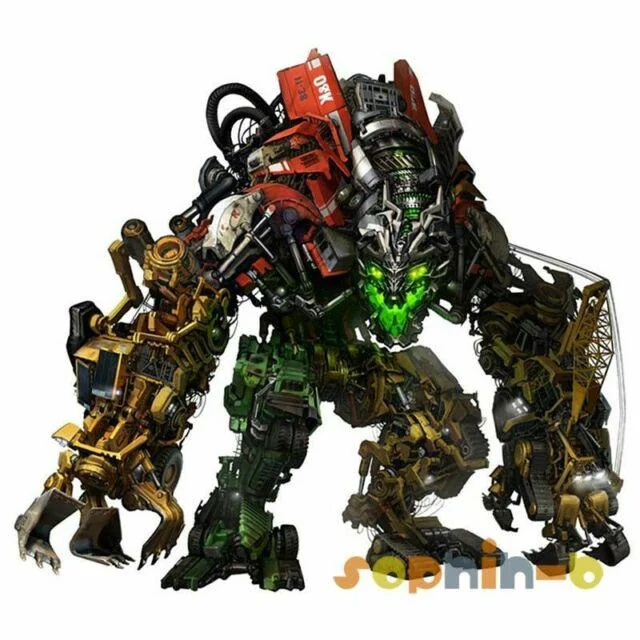

# Decepticons

<p align="center">
  
</p>

<p align="center">
  <a href="https://github.com/asuramaya/decepticons/actions/workflows/ci.yml"></a>
  <a href="https://github.com/asuramaya/decepticons/blob/main/LICENSE"></a>
  
  
</p>

<p align="center">
  <a href="https://asuramaya.github.io/decepticons/"><b>Website</b></a> ·
  <a href="./docs/architecture.md">Architecture</a> ·
  <a href="./docs/kernel_matrix.md">Kernel matrix</a> ·
  <a href="./examples/README.md">Examples</a> ·
  <a href="./docs/related_work.md">Related work</a>
</p>

> **O(n) attention is deception.** A backend-neutral kernel of predictive
> primitives — substrates, memory, gating, routing, readouts — that downstream
> systems combine into trained models without forking the kernel itself.

`decepticons` is the shared mechanism layer for predictive descendants. It
extracts the reusable parts (substrate dynamics, controller summaries, memory
primitives, feature views, readouts, runtime helpers) from a broader experiment
family so downstream systems can specialize without forking the kernel.

## Install

Python ≥ 3.11. Numpy is the only hard dependency for the kernel.

```bash
python3 -m venv .venv
source .venv/bin/activate
pip install -e .
```

For the model backends:

```bash
pip install -e ".[torch]"   # PyTorch CausalBankModel + routed readouts
pip install -e ".[metal]"   # Apple MLX backend
```

## Quickstart

```python
from decepticons import ByteCodec, ByteLatentPredictiveCoder

text = "predictive coding likes repeated structure.\n" * 64
model = ByteLatentPredictiveCoder()
report = model.fit(text)

prompt = ByteCodec.encode_text("predictive ")
sample = model.generate(prompt, steps=40, greedy=True)

print(report.train_bits_per_byte)
print(ByteCodec.decode_text(sample))
```

CLI:

```bash
decepticons fit --input ./corpus.txt --prompt "predictive " --generate 80
```

A complete worked example lives in
[`examples/quickstart.py`](./examples/quickstart.py). For descendant-shaped
projects, see [`examples/projects/`](./examples/projects).

## What's in the kernel

| Area | Highlights |
| --- | --- |
| **Substrates** | recurrent, delay, linear-memory, oscillatory, mixed, hierarchical |
| **Control** | controller summaries, pathway gates, summary routing, hormone modulation, predictive surprise |
| **Memory** | exact-context, n-gram, statistical-backoff, online n-gram, cache views |
| **Views** | byte-latent, hierarchical, linear-memory, sampled multiscale, bridge features, probability diagnostics |
| **Readouts** | ridge, frozen-readout expert, sampled multiscale, GRU recurrent, routed squared-ReLU |
| **Adapters** | causal predictive, oracle analysis, bridge export, noncausal reconstructive, paired teacher/export |
| **Runtime** | traces, fit reports, rollout evaluation, transfer probes, train-mode checkpoints, artifact accounting |
| **Causal-bank** | family metadata + deterministic substrate construction (frozen / learnable-decays / learnable-mixing / learned-recurrence / gated-retention) |
| **Backends** | numpy-only kernel; PyTorch and MLX `CausalBankModel` implementations |

Full capability matrix: [`docs/kernel_matrix.md`](./docs/kernel_matrix.md).

## Architecture

```
decepticons  ──→  chronohorn  ──→  heinrich
  kernel          runtime          evidence / audit
 (this repo)   training, fleet     model forensics
```

Three layers inside this repo:

1. **Kernel** — `src/decepticons/`. Public package. Reusable mechanisms only.
2. **Project descendants** — `examples/projects/`. Pressure-tests the kernel
   boundary with concrete descendant shapes (causal · oracle · bridge · noncausal · byte-latent).
3. **Tooling** — `examples/tools/`. Development and analysis scripts. Not part
   of the public package.

Code moves into `src/` only when **all three** hold:

1. it is a mechanism, not a project policy
2. at least two descendants want the same thing
3. the generalized API is simpler than keeping the duplication

This rule is the main defense against turning the kernel into a renamed
collection of branches. Full detail in
[`docs/architecture.md`](./docs/architecture.md) and the boundary against the
runtime in [`docs/chronohorn_boundary.md`](./docs/chronohorn_boundary.md).

## Causality is verified

All substrate modes are verified by
[`tests/test_causality.py`](./tests/test_causality.py). The test feeds two
identical sequences up to position *t*, different after *t*. If logits at
position *t* differ, causality is violated and CI fails. Modes verified:
`frozen`, `learnable_mixing`, `learnable_decays`, selective scan augment
(`state_dim > 0`), `readout_bands`, routed experts.

The dependency firewall — that decepticons never imports its descendants — is
enforced by an AST scan in
[`tests/test_dependency_firewall.py`](./tests/test_dependency_firewall.py).

## Docs

- [`docs/architecture.md`](./docs/architecture.md) — package map, three-layer model, promotion rule
- [`docs/kernel_matrix.md`](./docs/kernel_matrix.md) — capability matrix
- [`docs/chronohorn_boundary.md`](./docs/chronohorn_boundary.md) — boundary against the runtime descendant
- [`docs/downstream_patterns.md`](./docs/downstream_patterns.md) — causal, noncausal, oracle, bridge, byte-latent patterns
- [`docs/related_work.md`](./docs/related_work.md) — research anchors and prior art
- [`docs/landscape.md`](./docs/landscape.md) — ecosystem snapshot (March 2026)
- [`docs/lineage.md`](./docs/lineage.md) — source attribution
- [`examples/README.md`](./examples/README.md) — example descendants and tooling
- [`tests/README.md`](./tests/README.md) — verification surface

## Scope

This is a research kernel and reference implementation. The current pressure
from descendants is O(n) causal-bank architecture search — cheap ablation lanes
to separate mechanisms before promotion, with scale and context survival
checked in the descendant runtime.

It is not a frontier runtime, a production compression stack, or a benchmark
claim. It exists to keep the shared mechanism layer reusable and legible.

## Contributing

See [`CONTRIBUTING.md`](./CONTRIBUTING.md). Issues and pull requests welcome.

## License

MIT — see [`LICENSE`](./LICENSE).
